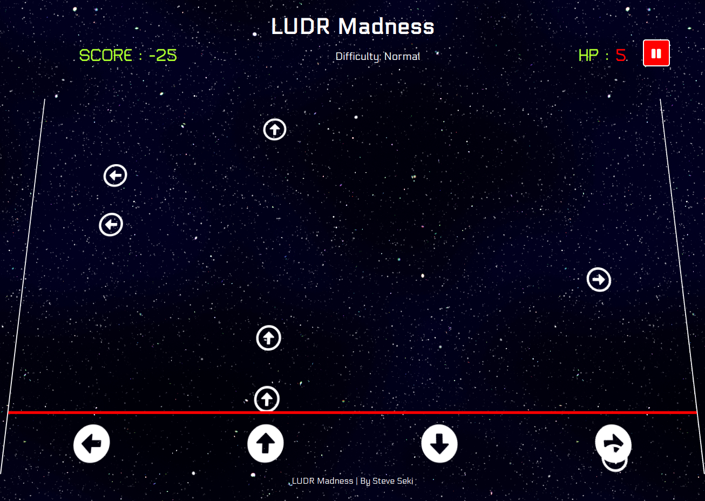
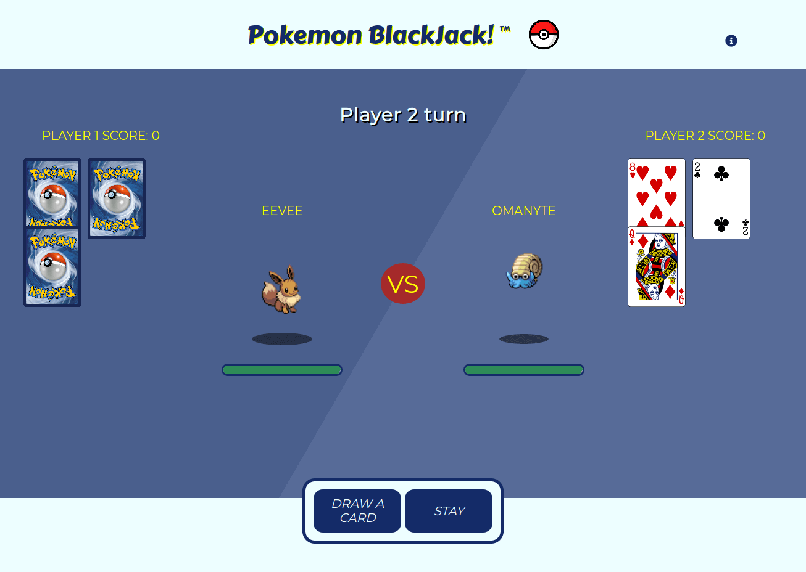

# Critical Mass
Application Responses

## Work / Project Examples

### 1. jQuery Game
 - Solo Project
 - First full project made in jQuery with firebase integration for leaderboard.
 - Works great on mobile

[GitHub Repository](https://github.com/tseki88/steveSekiProjectThree "GitHub Repository")

[Live Link](http://tseki88.github.io/steveSekiProjectThree "Live Link")

### 2. Group React Project
 - Mob programming project with 2 other developers.
 - Overall contribution was distributed amongst each developer.
 - Contributed to setting up majority of sound and music in game.

[GitHub Repository](https://github.com/pokemonBlackJack/pokemonBlackJack "GitHub Repository")

[Live Link](https://pokemonblackjack.github.io/pokemonBlackJack/ "Live Link")

## Inspiration

### 1. Bruno Simon's Portfolio Page
 - Amazed at what can be accomplished with the use of [Three.js](https://threejs.org/)
 - Creativity and thinking outside the box (though not accessible)

https://bruno-simon.com/

### 2. Dark / Light Theme
 - Insightful article on improving UX, which I look to implement in future projects.
 - Takes into consideration the user's preference, and loads that theme on default.

https://gosink.in/javascript-css-toggle-dark-light-theme-based-on-your-users-preferred-scheme/

## Focus
 - I would love to have the opportunity on getting exposure to larger-scale projects for:
    - Project Architecture
    - Code Organization
    - Pull Request Process
    - Testing
 - Learning best practices, and additional tooling

## Code Challenge 

### [CodeSandbox Link](https://codesandbox.io/s/2020-internship-exercise-menu-steve-seki-1r1pd)